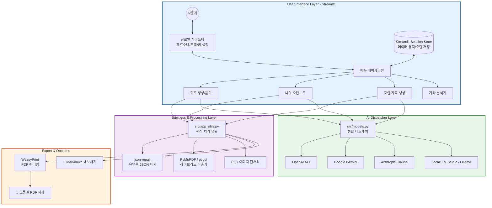

# 🎓 Local AI Instruction (교육용 AI 플랫폼)

로컬 LLM(LM Studio) 및 클라우드 AI(Gemini, OpenAI, Claude)를 활용하여 교육 자료 분석, 문제 생성, 인터랙티브 퀴즈 풀이, 오답노트 관리를 수행하는 **올인원 에듀테크 플랫폼**입니다.

---

---

## 🌟 주요 핵심 기능

### 1. 🎯 지능형 문항 생성 및 인터랙티브 풀이 (Smart Quiz System)
- **JSON 기반 정밀 파싱**: AI 응답을 JSON 구조로 강제하여 파싱 에러를 최소화하고 데이터 신뢰성을 확보했습니다.
- **다양한 문항 유형**: 4지선다, 단답형, 서술형, T/F, 빈칸 채우기 등 교육 목적에 맞는 다양한 유형을 생성합니다.
- **실시간 풀이 환경**: 생성된 퀴즈를 앱 내에서 즉시 풀고 채점 결과를 확인할 수 있는 전용 UI를 제공합니다.

### 2. 📓 스마트 오답노트 & 과목 자동 추론
- **오답노트 분류 관리**: 틀린 문제를 과목별로 자동 분류하거나 수동으로 필터링하여 복습할 수 있습니다.
- **자동 과목 추론 (Subject Inference)**: 별도의 설정 없이도 AI가 문제의 문맥을 파악해 국어, 수학, 영어 등 적절한 카테고리를 판단하여 저장합니다.
- **지속적 학습 피드백**: 저장된 오답은 언제든 다시 확인하고 해설을 복습할 수 있습니다.

### 3. 📄 고해상도 PDF 및 멀티미디어 분석
- **Hybrid Extraction**: PyMuPDF와 PyPDF를 병행 사용하여 고난도 레이아웃의 PDF에서도 텍스트와 이미지를 완벽하게 추출합니다.
- **Vision 지원**: 이미지 파일을 분석하여 텍스트로 변환하거나 문제를 풀이하는 시각 분석 기능을 탑재하고 있습니다.

### 4. 👩‍🏫 전역 사용자 페르소나 (Global AI Persona)
- **교육자용 모드**: 교수법 조언, 상세 채점 기준, 교육적 피드백 제공.
- **수강생용 모드**: 쉬운 개념 설명, 메타인지 가이드, 단계별 힌트 제공.

---

---

## 🏗 시스템 아키텍처 (System Architecture)

본 프로젝트는 대규모 언어 모델(LLM)과 문서 분석 엔진을 유연하게 결합한 **하이브리드 시스템 아키텍처**를 채택하고 있습니다.

### 📊 시스템 아키텍처 다이어그램

### 🧱 계층별 상세 설명

#### 1. **User Interface Layer**
- **모듈화된 라우팅**: `app/pages/` 하위의 독립적인 파일들이 기능을 담당하며 `main.py`가 이를 조율합니다.
- **상태 관리**: `st.session_state`를 통해 퀴즈 결과, 오답 목록, 사용자 설정 등을 전역적으로 공유합니다.
- **반응형 디자인**: 커스텀 CSS와 Glassmorphism 스타일을 적용하여 프리미엄 학습 환경을 제공합니다.

#### 2. **Business & Processing Layer**
- **Robust Parser**: AI의 응답이 불완전하더라도 `json-repair`를 통해 유효한 데이터로 복구하여 시스템 안정성을 보장합니다.
- **Document Engine**: PDF의 텍스트 레이아웃 손실을 최소화하기 위해 `PyMuPDF`의 인지 기반 추출과 `pypdf`의 구조적 추출을 병행합니다.

#### 3. **AI Dispatcher Layer**
- **통합 인터페이스**: 각기 다른 LLM 제공자들의 API 명세를 단일화하여 개발 효율성을 높였습니다.
- **BYOK (Bring Your Own Key)**: 서버 비용 부담 없이 사용자가 자신의 리소스를 안전하게 사용할 수 있도록 설계되었습니다.

#### 4. **Export & Outcome Layer**
- **High-Fidelity PDF**: Markdown에서 HTML을 거쳐 WeasyPrint로 렌더링되는 파이프라인을 통해 학습지에 최적화된 PDF를 생성합니다.
- **LaTeX Math Support**: 모든 렌더링 과정에서 복잡한 수학 수식을 완벽하게 보존합니다.

---

## 📂 코드 구조 상세
- **Language**: Python 3.10+
- **Frontend**: Streamlit (with Custom CSS / Glassmorphism)
- **AI Backend**: OpenAI SDK, Google Generative AI, Anthropic API
- **Document Engine**: PyMuPDF, PyPDF, WeasyPrint
- **Logic Support**: json-repair (Robust Parser), Matplotlib (Formula Rendering)

---

## 🚀 시작하기
1. 레포지토리를 클론합니다.
2. `pip install -r requirements.txt`로 필요한 의존성을 설치합니다.
3. `streamlit run app/main.py` 명령어로 플랫폼을 실행합니다.
