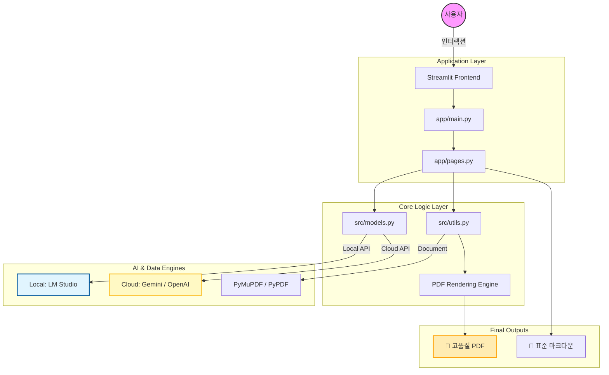

# 🎓 Local AI Instruction (교육용 AI 플랫폼)

로컬 LLM(LM Studio) 및 클라우드 AI(Gemini, OpenAI 등)를 활용하여 교육 자료 분석, 문제 풀이, 교안 생성 등을 수행하는 **올인원 교육 지원 플랫폼**입니다.

---

## 🏗 시스템 아키텍처

본 프로젝트는 사용자 경험과 성능을 동시에 고려한 하이브리드 AI 아키텍처를 채택하고 있습니다.

- **Frontend**: `Streamlit` 기반의 인터랙티브 웹 인터페이스.
- **AI Orchestration**: 로컬(LM Studio)과 클라우드(OpenAI, Gemini) 모델을 자유롭게 전환하며 최적의 비용과 성능을 선택 가능한 멀티 프로바이더 구조.
- **Document Pipeline**: 
  - **Parsing**: `PyMuPDF`, `PyPDF`를 통한 텍스트 및 이미지 추출.
  - **Rendering**: `Markdown` → `HTML` → `WeasyPrint`를 거치는 고품질 PDF 생성 파이프라인.
  - **Math Logic**: LaTeX 수식 자동 수선 및 SVG 변환 시스템 탑재.

---

## 📂 코드 구조 상세

### 📦 `app/` - UI 및 사용자 인터페이스
- **`main.py`**: 애플리케이션의 엔트리 포인트. 전역 설정(사이드바, AI 모드, 프로바이더) 및 메인 라우팅을 담당합니다.
- **`pages.py`**: 각 도구별 렌더링 함수와 분석 로직의 UI 결합부를 포함합니다. (`render_pdf_analyzer`, `render_chatbot` 등)

### 📦 `src/` - 비즈니스 로직 및 핵심 라이브러리
- **`config.py`**: API 키, 모델 파라미터, PDF 분석 장수 제한 등 프로젝트 전역 설정을 관리합니다.
- **`models.py`**: 다양한 AI 서비스(API)와의 통신을 표준화한 통신 계층입니다.
- **`utils.py`**: 프로젝트의 심장부로, 다음의 유틸리티를 제공합니다:
  - 이미지 전처리 및 Base64 인코딩
  - LaTeX 수식 보호 및 수학적 정규화
  - 마크다운의 PDF 변환 및 CSS 레이아웃 제어
  - 보안 파일명 생성 및 데이터 변환
- **`prompts/system_prompts.py`**: 교육적 관점을 정의한 전문 시스템 프롬프트 및 코드 블록 가이드라인이 저장되어 있습니다.

---

## 🌟 주요 핵심 기능

### 1. 전역 사용자 모드 (Global User Mode)
사이드바에서 선택한 모드가 앱 전체의 AI 페르소나를 결정합니다.
- **👩‍🏫 교육자용**: 전문적인 교수법 팁, 상세 해설, 채점 가이드 중심.
- **👨‍🎓 수강생용**: 쉬운 비유, 단계별 학습 원리, 자기주도 학습 가이드 중심.

### 2. 고품질 PDF 분석 및 생성
- **문제 추출 모드**: 대형 PDF에서 문제를 지능적으로 식별하여 개별 풀이를 생성합니다.
- **문서 요약/노트화**: 복잡한 교재를 학습형 요약 노트로 즉시 변환합니다.
- **PDF 커스텀 렌더링**: 
  - **Pygments 구문 강조**: 코드 블록에 Monokai 테마 적용.
  - **레이아웃 최적화**: 코드 자동 줄바꿈 및 글자 크기 자동 조정을 통한 가독성 확보.

### 3. 멀티 도메인 분석기
- **이미지 문제 풀이**: 사진만 찍어 올리면 분석부터 풀이까지 원스톱 제공.
- **코드 분석기**: 실시간 코드 리뷰, 성능 최적화 및 시간 복잡도 분석.
- **평가 문항 생성기**: 텍스트 자료를 바탕으로 블룸의 분류체계를 따른 고해설 문제 출제.

---

## 🛠 기술 스택
- **Language**: Python 3.10+
- **Framework**: Streamlit
- **AI Connection**: OpenAI SDK, Local LLM via LM Studio
- **Processing**: 
  - Vision/Image: PIL, OpenCV
  - Document: WeasyPrint (PDF), Markdown (conversion)
- **Math**: Matplotlib (SVG rendering), LaTeX
